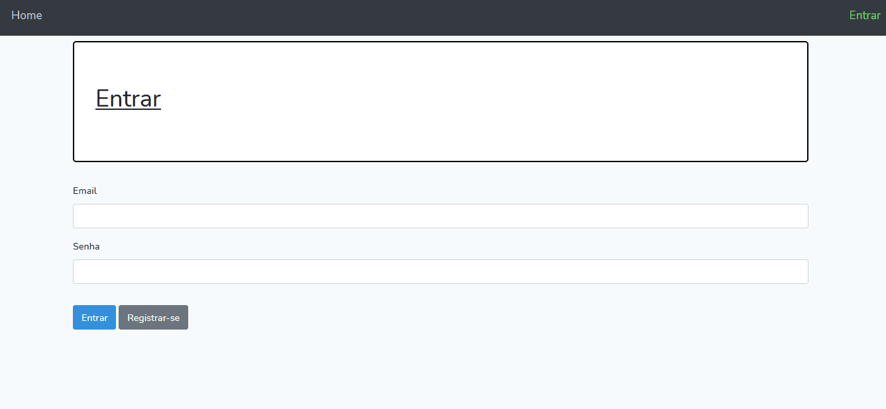

# El super controlo de series porretas!

<br>
<br>
Esse projeto foi desenvolvido no curso de Laravel da Alura!
<br><br>

### 🔧 Tecnologias utilizadas:
- PHP 7.4.13
- Composer 2.0.7
- NPM 6.14.5
- Laravel 5.8.*

### 📐 Técnicas utilizadas:
- FormRequests para validação de formulários.
- Php artisan cli para criar controllers, formrequests, models, middlewares, migratios, tests e subir o servidor!
- Padrão MVC.
- Uso da Fetch API do javascript.
- Uso do Blade Templates para front-end.

### Como rodar ?

Clone o projeto com ```git clone https://github.com/juststudies/controlador-de-series.git ``` para seu diretório a trabalhar.
Use ``` composer install ```.
Use algum servidor local ou, caso possua php artisan, use ``` php artisan serve ```